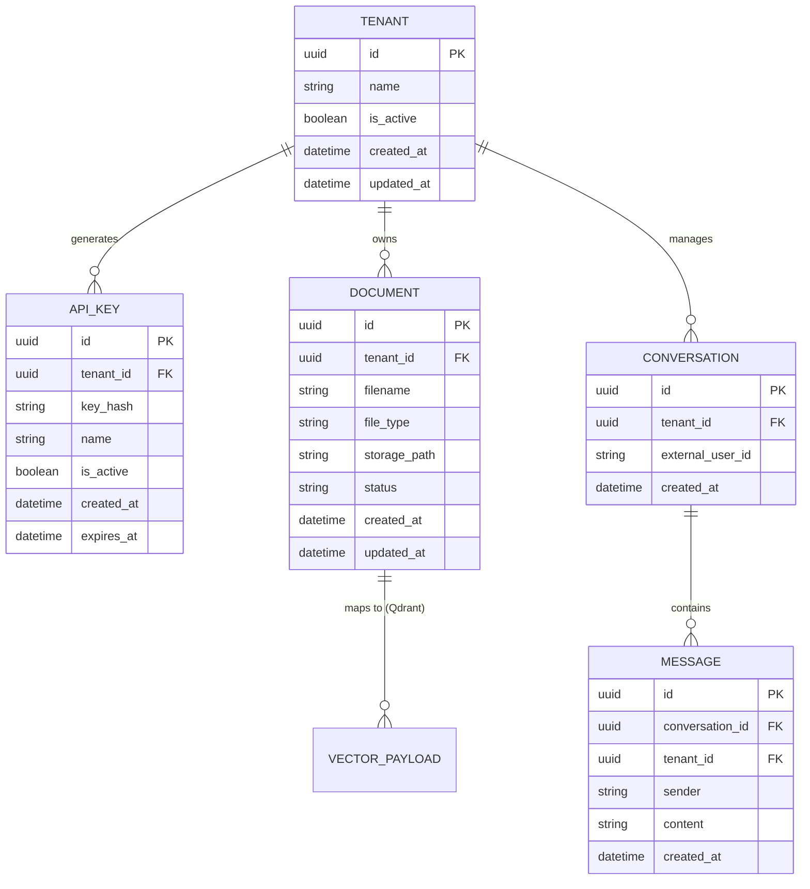

# Database Design & Data Model (OmniRAG SaaS)

Tài liệu này mô tả chi tiết thiết kế cơ sở dữ liệu cho dự án **OmniRAG** bao gồm Cơ sở dữ liệu quan hệ (PostgreSQL - dùng SQLModel) và Cơ sở dữ liệu vector (Qdrant) với tiêu chuẩn bảo mật Multi-Tenancy làm trọng tâm.

---

## 1. Cơ sở dữ liệu quan hệ (PostgreSQL)

Chúng ta sử dụng **SQLModel** (kết hợp SQLAlchemy và Pydantic) để làm việc với PostgreSQL. Hệ thống sẽ có các bảng chính sau:



### 1.1 Chi tiết các Bảng & SQLModel Models

#### A. Table `tenants` (Thông tin khách thuê)
Lưu trữ thông tin định danh của từng doanh nghiệp/khách hàng tích hợp hệ thống.

```python
import uuid
from datetime import datetime
from typing import Optional, List
from sqlmodel import SQLModel, Field, Relationship

class Tenant(SQLModel, table=True):
    __tablename__ = "tenants"

    id: uuid.UUID = Field(default_factory=uuid.uuid4, primary_key=True, index=True)
    name: str = Field(nullable=False, max_length=255)
    is_active: bool = Field(default=True)
    created_at: datetime = Field(default_factory=datetime.utcnow, nullable=False)
    updated_at: datetime = Field(default_factory=datetime.utcnow, nullable=False)

    # Relationships
    api_keys: List["APIKey"] = Relationship(back_populates="tenant", cascade_delete=True)
    documents: List["Document"] = Relationship(back_populates="tenant", cascade_delete=True)
    conversations: List["Conversation"] = Relationship(back_populates="tenant", cascade_delete=True)
```

#### B. Table `api_keys` (Quản lý khóa API)
Dùng để xác thực request từ client gửi lên API. Lưu mã hash của API Key (SHA-256) thay vì lưu key thô để đảm bảo bảo mật.

```python
class APIKey(SQLModel, table=True):
    __tablename__ = "api_keys"

    id: uuid.UUID = Field(default_factory=uuid.uuid4, primary_key=True, index=True)
    tenant_id: uuid.UUID = Field(foreign_key="tenants.id", index=True, nullable=False)
    key_hash: str = Field(index=True, nullable=False, unique=True)
    name: str = Field(nullable=False, max_length=100, description="E.g., Production Key, Dev Key")
    is_active: bool = Field(default=True)
    created_at: datetime = Field(default_factory=datetime.utcnow, nullable=False)
    expires_at: Optional[datetime] = Field(default=None, nullable=True)

    # Relationships
    tenant: Tenant = Relationship(back_populates="api_keys")
```

#### C. Table `documents` (Quản lý tài liệu đã tải lên)
Lưu vết metadata của các file đã được upload lên hệ thống trước khi parse và chunk vào Vector DB.

```python
class Document(SQLModel, table=True):
    __tablename__ = "documents"

    id: uuid.UUID = Field(default_factory=uuid.uuid4, primary_key=True, index=True)
    tenant_id: uuid.UUID = Field(foreign_key="tenants.id", index=True, nullable=False)
    filename: str = Field(nullable=False, max_length=512)
    file_type: str = Field(nullable=False, max_length=50)  # pdf, txt, json, url
    storage_path: Optional[str] = Field(default=None, description="Đường dẫn lưu trữ file vật lý trên local/S3")
    status: str = Field(default="processing", max_length=50)  # processing, completed, failed
    created_at: datetime = Field(default_factory=datetime.utcnow, nullable=False)
    updated_at: datetime = Field(default_factory=datetime.utcnow, nullable=False)

    # Relationships
    tenant: Tenant = Relationship(back_populates="documents")
```

#### D. Table `conversations` (Phiên hội thoại)
Quản lý lịch sử trò chuyện. `external_user_id` là định danh của user cuối trên website của Tenant.

```python
class Conversation(SQLModel, table=True):
    __tablename__ = "conversations"

    id: uuid.UUID = Field(default_factory=uuid.uuid4, primary_key=True, index=True)
    tenant_id: uuid.UUID = Field(foreign_key="tenants.id", index=True, nullable=False)
    external_user_id: Optional[str] = Field(default=None, index=True, max_length=255)
    created_at: datetime = Field(default_factory=datetime.utcnow, nullable=False)

    # Relationships
    tenant: Tenant = Relationship(back_populates="conversations")
    messages: List["Message"] = Relationship(back_populates="conversation", cascade_delete=True)
```

#### E. Table `messages` (Tin nhắn chi tiết)
Lưu chi tiết từng tin nhắn trong một phiên hội thoại để chatbot có thể lấy ngữ cảnh trò chuyện (chat history).

```python
class Message(SQLModel, table=True):
    __tablename__ = "messages"

    id: uuid.UUID = Field(default_factory=uuid.uuid4, primary_key=True, index=True)
    conversation_id: uuid.UUID = Field(foreign_key="conversations.id", index=True, nullable=False)
    tenant_id: uuid.UUID = Field(foreign_key="tenants.id", index=True, nullable=False)  # Đắp thêm tenant_id để phục vụ rule bảo mật
    sender: str = Field(nullable=False, max_length=50)  # user, assistant, system
    content: str = Field(nullable=False)
    created_at: datetime = Field(default_factory=datetime.utcnow, nullable=False)

    # Relationships
    conversation: Conversation = Relationship(back_populates="messages")
```

---

## 2. Cơ sở dữ liệu Vector (Qdrant)

Để đảm bảo hiệu năng và đơn giản trong quản lý tài nguyên, hệ thống sử dụng **một Collection duy nhất** cho toàn bộ hệ thống SaaS, kết hợp với trường Payload Filter `tenant_id` để phân lập dữ liệu.

### 2.1 Cấu hình Collection
*   **Collection Name:** `omnirag_documents`
*   **Vector Size:** `1536` (Tương thích với model `text-embedding-3-small` của OpenAI) hoặc `768` (nếu dùng model embedding của Gemini).
*   **Distance Metric:** `Cosine`

### 2.2 Schema của Payload (Vector Metadata)
Mỗi Vector được lưu trữ trong Qdrant sẽ đi kèm với Payload có cấu trúc như sau:

```json
{
  "tenant_id": "8f8e1234-5678-12d3-a456-426614174000",
  "document_id": "a9a81234-5678-12d3-a456-426614174111",
  "text": "Nội dung đoạn văn bản đã được cắt nhỏ (chunk) từ tài liệu...",
  "chunk_index": 0,
  "metadata": {
    "page_number": 1,
    "source": "chinh-sach-bao-hanh.pdf"
  }
}
```

### 2.3 Cấu hình Payload Indexes (Quan trọng)
Để tối ưu hóa tốc độ tìm kiếm tương đồng trên tập dữ liệu lớn của SaaS, bắt buộc phải tạo Index cho các trường lọc sau trong Qdrant:
1.  **Index cho `tenant_id` (Kiểu Keyword):** Để lọc nhanh toàn bộ vector thuộc về một tenant trước khi chạy thuật toán tìm kiếm khoảng cách ANN (Approximate Nearest Neighbors).
2.  **Index cho `document_id` (Kiểu Keyword):** Để hỗ trợ tính năng xóa nhanh toàn bộ vector của một tài liệu khi tenant yêu cầu xóa tài liệu đó.

---

## 3. Quy chuẩn bảo mật & Cơ chế Cách ly Dữ liệu (Multi-Tenancy)

### 3.1 Cách ly ở tầng PostgreSQL
Tất cả các hàm query dữ liệu phải nhận `tenant_id` (được inject từ API router sau khi giải mã API Key) để áp dụng vào câu lệnh select:

```python
from sqlmodel.ext.asyncio.session import AsyncSession
from sqlmodel import select

async def get_tenant_documents(db: AsyncSession, tenant_id: uuid.UUID):
    # Luôn lọc theo tenant_id
    statement = select(Document).where(Document.tenant_id == tenant_id)
    results = await db.exec(statement)
    return results.all()
```

### 3.2 Cách ly ở tầng Qdrant (Vector DB)
Khi truy vấn tương đồng (Similarity Search) tại Service, bắt buộc phải cấu hình bộ lọc `Filter` so khớp `tenant_id`:

```python
from qdrant_client import AsyncQdrantClient
from qdrant_client.http import models

async def search_similar_chunks(
    qdrant_client: AsyncQdrantClient, 
    tenant_id: str, 
    query_vector: list[float], 
    limit: int = 5
):
    search_result = await qdrant_client.search(
        collection_name="omnirag_documents",
        query_vector=query_vector,
        query_filter=models.Filter(
            must=[
                models.FieldCondition(
                    key="tenant_id",
                    match=models.MatchValue(value=tenant_id)
                )
            ]
        ),
        limit=limit
    )
    return search_result
```
